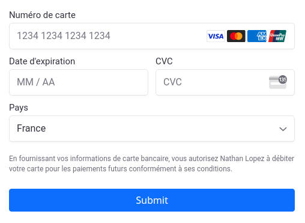

# Payify

PayifyRails is a Ruby gem that simplifies payment integration into Ruby on Rails projects. It allows to easily add payment functionality to your models. For example, by applying the HasPaymentConcern to a reservation model, you can manage the payment process for reservations seamlessly.



## Status 🚧

This gem is under construction. Stay tuned for exciting updates as I continue to shape it.

## Installation

To install the gem add it into a Gemfile (Bundler):

```ruby
gem 'payify', git: 'https://github.com/andrewdsilva/payify'
```

And then execute:

```
bundle install
```

## Features ✅

- Includes a Payment model
- Provides concerns to easily add a payment system to your model
- Allows configuration of payment modes (initially supports Stripe)
- Provides a user interface for payment processing
- Enables management of payment status (pending, paid)

## Configuration

By default, Payify uses Stripe as the payment gateway. You can configure the currency using an initializer.

```ruby
# initializers/payify.rb
Payify.setup do |config|
  config.currency = "usd"
  config.default_tax_rates_id = "eur"
end
```

To handle VAT or different tax rates on your payments, you need to create tax rates on Stripe and define the default_tax_rates_id or, alternatively, define the tax_rates_id method on your payment-related models. Leave it empty if you don't manage any taxes.

You can set your Stripe API credentials using environment variables. (Secret key, Publishable key)

```ruby
# .env
STRIPE_API_KEY="..."
STRIPE_PUBLISHABLE_KEY="..."
```

## Usage

To enable payment functionality for a model, simply include the HasPayment concern:

```ruby
class Reservation < ApplicationRecord
  include Payify::HasPaymentConcern

  def ammount_to_pay
    self.price
  end

  # Optional : Override the default tax rates id
  def tax_rates_id
    'txr_1234567890'
  end
end
```

When you want to request a payment for a model on which you added the concern, you just need to call the create_payment method.

```ruby
reservation_1.create_payment
```

Then you can find the id of the payment (pending) thanks to payment.id.

```ruby
reservation_1.payment.id
```

Now you just have to redirect the user to `/payments/:id/new` or include the payment form in your page.

```ruby
# reservation/show.html.erb
<%= render "payify/payments/form", payment: @payment %>
```

After completing the payment process, the user will be redirected to:

```
/payments/:id/complete
```

The application will then verify the payment status with Stripe. You can do it manually calling the following method:

```ruby
@payment.stripe_confirm_payment
```

If the payment has been successfully processed, a confirmation message will be displayed to the user. The payment object's `paid?` attribute will be set to `true`.

To customize the page that displays the payment status, you can create the following file:

```
views/payify/payments/complete.html.erb
```

If you prefer using the Payify API, you can make a request to the following endpoint to update the payment status and retrieve its current state:

```
/payments/:id/complete.json
```
## Status

You can access the payment status using `@payment.status`. The possible statuses are:

- `pending`: The payment is still being processed.
- `paid`: The payment has been successfully completed.
- `failed`: The payment has failed.

## Tests

To run the tests, execute `rspec` command.

You can test the payment process in your web browser by following these steps:

1. Navigate to the `test/dummy` directory.
2. Run the following commands:
   - `rails db:create`
   - `rails db:migrate`
   - `rails db:seed`
   - `rails s`
3. Open your browser and go to: [http://localhost:3000/](http://localhost:3000/).

Each time you run the seed command, your test database will be reset with a reservation that has a payment with an ID of 1. This allows you to test the payment process at the following address: [http://localhost:3000/payments/1/new](http://localhost:3000/payments/1/new).

## Contributing

Bug reports and pull requests are welcome on GitHub at https://github.com/andrewdsilva/payify.

## License

The gem is available as open source under the terms of the [MIT License](https://opensource.org/licenses/MIT).
